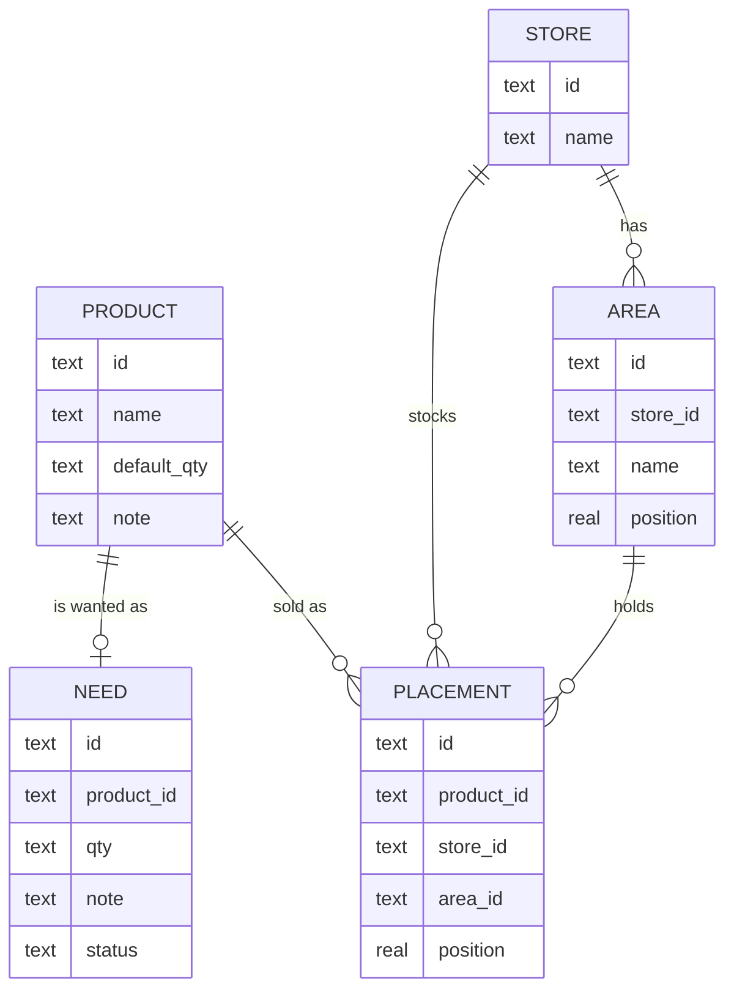

# Family Grocery App — Specification

A mobile-first, offline-capable shopping app for a family. You maintain a master
list of **products**, mark which ones you currently **need**, then shop one
**store** at a time following a checklist ordered to match your physical path
through that store.

Status: **implemented** on branch `rewrite-mobile-first` (Phases 0–8). The old
`worker.js` / single-file frontend / KV setup have been replaced. Phase 9 (deploy)
is run by the maintainer against their Cloudflare account — see the README.

---

## 1. Goals

- **Mobile-first.** Designed for a phone held in one hand, in a shop, possibly on
  a bad connection. Every primary action is in the thumb zone; tap targets are
  large; no `prompt()`/`alert()`.
- **Offline-capable, online-too.** The app works with no signal (all data lives
  on the device) and syncs automatically when a connection is available.
- **Store-path optimized.** The in-store checklist is ordered so you pick items
  up one after another as you walk, without backtracking.
- **Multi-store.** A product can be bought at several stores; each store has its
  own layout, so each store orders the same products differently.
- **Shared, low-friction.** One family password. No per-user accounts.
- **Free to run.** Cloudflare Workers + D1, both within the free tier.

## 2. Design principles

1. Content first — chrome collapses, the list fills the screen.
2. One primary action per screen, bottom-anchored.
3. Immediate feedback, optimistic writes, **undo instead of confirm**.
4. Gestures are shortcuts, never the only path.
5. The app teaches itself the store layout as you use it (drag once, remembered).
6. Respect the platform: safe areas, keyboard insets, reduced motion, dark mode.

---

## 3. Concepts & data model

| Concept | Meaning |
|---|---|
| **Product** | An item you might buy, ever. The master catalog. `Milk`, `Apples`, `Dish soap`. |
| **Need** | A product you currently want to buy. Has a status: `needed` or `in_cart`. Store-agnostic. |
| **Store** | A shop you visit. `Lidl`, `Costco`, `Pharmacy`. |
| **Area** | A section of *one* store, e.g. `Produce`, `Back wall`, `Freezers`. Areas are kept in **walking order** — the path through that store. |
| **Placement** | "I buy this product at this store, and it lives in this area." Links a product to a store, an area, and a position within that area. |

### Relationships



### The shopping view is a query

For the selected store **S**:

1. Take every `Need` that is not `deleted`.
2. Keep those whose product has a `Placement` at **S** → join to that placement's
   area + position.
3. Group by area; order areas by `area.position`; order items within an area by
   `placement.position`.
4. Needs whose product has **no** placement at **S** go to a collapsed
   *"Not sold here"* section.

Concatenating the groups top to bottom gives one continuous, optimally ordered
checklist.

### IDs and positioning

- `product`, `store`, `area` — random 128-bit hex IDs.
- `placement.id` = `"{product_id}:{store_id}"` (deterministic — a product has at
  most one placement per store, so sync merges have no ambiguity).
- `need.id` = `product_id` (a product is either needed or not).
- `position` — a `REAL`. Inserting between two rows uses the midpoint, so a
  reorder rewrites **one** row. Positions are renormalized to integers when gaps
  get too small (< 1e-4) or on demand.

### Lifecycle rules

- **Add / remove on the Products screen**: the +/− control creates or tombstones
  the `Need`. On the Products catalog "buy at" toggles (or creating a product
  with stores selected) also create the `Placement`; a bare add with no store
  leaves the product unplaced (shows under *Not sold here*).
- **Check off** an item → `Need.status = in_cart` (short "in cart — Undo" toast).
- **Finish shopping** → after a confirm sheet, tombstone every need on the current
  store's list — `in_cart` **and** `needed` (i.e. any need whose product is placed
  at that store). Needs with no placement there ("Not sold here") stay. "Any store"
  mode clears all needs. 8-second Undo restores exact prior state.
- **Delete a store** → tombstone the store, its areas, and its placements.
  Products and needs are untouched.
- **Delete a product** → tombstone the product, its placements, and its need.
- **Delete an area** → tombstone it; its placements fall back to `Unsorted`.

---

## 4. Architecture

```
┌── Phone ───────────────────────────────┐          ┌── Cloudflare ──────────────┐
│  PWA (installed / browser)             │          │                            │
│                                        │  HTTPS   │  Worker (module)           │
│  UI  ─────▶  Local store (IndexedDB)   │ ───────▶ │   /api/setup  /api/auth    │
│               ▲        │               │  /sync   │   /api/sync                │
│               │        ▼               │ ◀─────── │        │                   │
│          Sync engine (push dirty,      │  delta   │        ▼                   │
│           pull since cursor, LWW)      │          │      D1 (SQLite)           │
│                                        │          │                            │
│  Service worker: precache app shell    │          │  Static assets: app shell  │
└────────────────────────────────────────┘          └────────────────────────────┘
```

- The **device is the source of truth for the UI**. Every read is local; every
  write goes to IndexedDB first and renders immediately.
- The **server is a sync target**. It stores rows and answers "what changed since
  cursor X". It never renders and does no business logic beyond last-write-wins.
- **No KV.** Auth state lives in D1.

### Tech stack

| Layer | Choice | Why |
|---|---|---|
| Frontend | **Vue 3 + TypeScript, built with Vite** | SFCs with `<style scoped>` give per-component style isolation for the hand-rolled mobile CSS; clean reactivity; Vite is first-class. Ships as static files. |
| State | **Pinia** | One store holds the whole dataset + dirty tracking + sync status; components read reactively. |
| Local DB | **IndexedDB via `idb`** | Only reliable large local store on iOS Safari. Framework-agnostic. |
| Router | **`vue-router`**, minimal config | 3 tabs; sheets are component state, not routes. |
| Styling | Hand-rolled CSS with design tokens (custom properties), scoped per SFC | No CSS framework — full control of the mobile feel; smallest bundle for an offline PWA. |
| Dialog / sheet a11y | **Reka UI** (headless, unstyled) | Focus trap, scroll lock, `inert`, ESC/backdrop dismiss — fiddly to hand-roll correctly. Styled by us. |
| Drag-to-reorder | **`@formkit/drag-and-drop`** | Touch drag physics + edge auto-scroll; not worth reinventing. |

A full Material / component framework (Vuetify) and mobile meta-frameworks
(Quasar, Ionic) were considered and rejected: the app's signature interactions
(path reordering, swipe, sheets, pull-to-refresh) aren't what those libraries
provide, and their default look would need heavy re-theming. Everything else —
tab bar, rows, toasts, pull-to-refresh, progress — is hand-rolled.
| Backend | **Cloudflare Worker (module format)** | Current platform, free. |
| Database | **Cloudflare D1 (SQLite)** | Relational model fits exactly; delta-sync query is a simple indexed `WHERE updated_at > ?`. Free tier is ample for a family. |
| Hosting | Worker static assets (`[assets]`) | One deploy, one origin. |

---

## 5. Database schema (D1)

Every domain table carries `updated_at INTEGER` (ms epoch, **server-assigned** on
write) and `deleted INTEGER DEFAULT 0` (tombstone).

```sql
CREATE TABLE products (
  id          TEXT PRIMARY KEY,
  name        TEXT NOT NULL,
  default_qty TEXT,
  note        TEXT,
  updated_at  INTEGER NOT NULL,
  deleted     INTEGER NOT NULL DEFAULT 0
);

CREATE TABLE stores (
  id         TEXT PRIMARY KEY,
  name       TEXT NOT NULL,
  updated_at INTEGER NOT NULL,
  deleted    INTEGER NOT NULL DEFAULT 0
);

CREATE TABLE areas (
  id         TEXT PRIMARY KEY,
  store_id   TEXT NOT NULL,
  name       TEXT NOT NULL,
  position   REAL NOT NULL,
  updated_at INTEGER NOT NULL,
  deleted    INTEGER NOT NULL DEFAULT 0
);
CREATE INDEX idx_areas_store ON areas(store_id);

CREATE TABLE placements (
  id         TEXT PRIMARY KEY,          -- "{product_id}:{store_id}"
  product_id TEXT NOT NULL,
  store_id   TEXT NOT NULL,
  area_id    TEXT,                      -- NULL => Unsorted
  position   REAL NOT NULL,
  updated_at INTEGER NOT NULL,
  deleted    INTEGER NOT NULL DEFAULT 0
);
CREATE INDEX idx_placements_store ON placements(store_id);
CREATE INDEX idx_placements_product ON placements(product_id);

CREATE TABLE needs (
  id         TEXT PRIMARY KEY,          -- = product_id
  product_id TEXT NOT NULL,
  qty        TEXT,
  note       TEXT,
  status     TEXT NOT NULL DEFAULT 'needed',   -- 'needed' | 'in_cart'
  updated_at INTEGER NOT NULL,
  deleted    INTEGER NOT NULL DEFAULT 0
);

-- indexes for delta sync
CREATE INDEX idx_products_updated   ON products(updated_at);
CREATE INDEX idx_stores_updated     ON stores(updated_at);
CREATE INDEX idx_areas_updated      ON areas(updated_at);
CREATE INDEX idx_placements_updated ON placements(updated_at);
CREATE INDEX idx_needs_updated      ON needs(updated_at);

CREATE TABLE app_meta (
  key   TEXT PRIMARY KEY,
  value TEXT NOT NULL
);   -- 'password_hash' => hex HMAC

CREATE TABLE tokens (
  token      TEXT PRIMARY KEY,
  created_at INTEGER NOT NULL
);

CREATE TABLE auth_log (            -- migration 0002; Worker trims to last 500 rows
  id         INTEGER PRIMARY KEY AUTOINCREMENT,
  at         INTEGER NOT NULL,
  kind       TEXT NOT NULL,        -- 'setup' | 'unlock' | 'logout-all'
  ok         INTEGER NOT NULL,     -- 1 | 0
  user_agent TEXT,
  ip         TEXT
);
```

`Unsorted` is not a row — it's the client-side rendering bucket for
`placement.area_id IS NULL`, always shown last.

---

## 6. Sync protocol

Single endpoint: `POST /api/sync` (bearer auth).

**Request**

```jsonc
{
  "cursor": 1710000000000,          // last server cursor the client holds; 0 = full pull
  "changes": {                       // local rows changed since last successful sync
    "products":   [ { "id": "...", "name": "Oat milk", "updated_at": 1710000012345, "deleted": 0 } ],
    "needs":      [ ... ],
    "placements": [ ... ],
    "stores":     [ ... ],
    "areas":      [ ... ]
  }
}
```

**Server applies** each incoming row with last-write-wins, then re-stamps it:

```
existing = SELECT ... WHERE id = ?
if not existing OR incoming.updated_at >= existing.updated_at:
    row.updated_at = server_now()          # authoritative clock, avoids device skew
    UPSERT row
```

**Response**

```jsonc
{
  "cursor": 1710000099999,           // = max(updated_at) written this round / server now
  "changes": {                        // every row with updated_at > request.cursor
    "products": [ ... ], "needs": [ ... ], ...
  }
}
```

**Client** then: adopts server `updated_at` values on its pushed rows, merges the
returned rows into IndexedDB (LWW again, local-side), clears its dirty set,
stores the new `cursor`.

### Sync triggers (event-driven, no polling)

- App launch / service-worker activation.
- `visibilitychange` → visible (returning to the app).
- `online` event (connection restored).
- Debounced 3 s after any local mutation.
- Manual: pull-to-refresh on the Shop screen.

### Conflict behavior

Entity-level LWW. For a family with a handful of writers this is sufficient. Two
devices reordering the *same area* while both offline can interleave oddly; the
next load renormalizes positions and it self-heals. Documented, accepted.

### Tombstone GC

Server deletes rows with `deleted = 1 AND updated_at < now - 90 days` on a cron
(or lazily during sync). Clients drop tombstones older than the same window.

---

## 7. Auth

Unchanged in spirit from the draft, moved to D1:

- **First run:** `POST /api/setup { password }` — allowed only while
  `app_meta.password_hash` is unset. Stores `HMAC_SHA256(password, AUTH_SECRET)`.
  Returns a token.
- **Unlock:** `POST /api/auth { password }` — re-hashes, compares, issues a random
  token into `tokens`, returns it. 403 on mismatch.
- Client stores the token in `localStorage` (`grocery:token`) and sends
  `Authorization: Bearer <token>`. Tokens last 30 days (checked on use).
- **Log out everyone:** `POST /api/logout-all` (bearer) — deletes every row in
  `tokens`, so all devices (including the caller) must re-enter the password.
  Exposed in Settings → Sessions.
- **Sign-in log:** every `setup` / `unlock` / `logout-all` attempt (success and
  failure) is appended to `auth_log` with timestamp, raw User-Agent and
  `CF-Connecting-IP`. The Worker keeps the most recent 500 rows.
  `GET /api/auth-log` (bearer) returns the latest 100; shown in Settings →
  Sessions → *Sign-in log* (UA parsed to "Chrome · Mac" client-side; loopback
  IPs hidden).
- `/api/setup` and `/api/auth` are the only unauthenticated routes.
- `AUTH_SECRET` is a Worker secret (`.dev.vars` locally).

### Abuse / cost protection

The app runs on Cloudflare's free tiers; the goal is that a hostile visitor can
cause at most a day of downtime, never a bill.

- **Rate limiting** (Workers native rate-limit binding, keyed by `CF-Connecting-IP`,
  enforced per data centre):
  - `API_RL` — 200 req/min per IP across every `/api/*` route.
  - `AUTH_RL` — 10 req/min per IP on `/api/auth` + `/api/setup` on top of that.
  - Over budget → `429` + `Retry-After: 60`, returned **before** any D1 access.
- **Failed unlock** waits ~0.5 s before responding (wall-clock, not CPU).
- **Body cap**: any request with `Content-Length` > 512 KB → `413`.
- **`/api/health`** reads `configured` straight from D1 on every call — a
  single indexed lookup, cheap enough not to cache. (An earlier per-isolate
  cache was removed: it never reset after a password was cleared out of band,
  e.g. via the D1 dashboard console, leaving the login screen stuck showing
  "Enter the password" instead of "Choose a password" until that isolate
  recycled — correctness mattered more here than saving one D1 read.)
- **`auth_log`** trims to ~500 rows only ~10% of the time (one write per login,
  not two).
- **`SETUP_KEY`** (optional secret): if set, `/api/setup` also requires it in the
  body, closing the "first caller after deploy claims the password" window.
- **Password**: min 8 chars; stored as `HMAC-SHA256` (not a slow KDF — acceptable
  only because `AUTH_SECRET` is long/random *and* guessing is now rate-limited).
- Residual: the rate limiter is per-colo, so a large botnet can still burn
  Worker *requests* (not D1). The backstop is the **Workers Free plan's hard
  100k-req/day cap** (then 429, no charge) — or a **spending limit** if on the
  paid plan. This is an account setting, not code. See README.

---

## 8. HTTP API

| Method & path | Auth | Purpose |
|---|---|---|
| `POST /api/setup` | none | One-time password creation. |
| `POST /api/auth` | none | Password → token. |
| `POST /api/logout-all` | bearer | Revoke every session (truncate `tokens`). |
| `GET /api/auth-log` | bearer | Latest 100 sign-in-log entries. |
| `POST /api/sync` | bearer | Delta push + pull (section 6). |
| `GET /api/health` | none | Liveness for the service worker. |

Every route can also return `429` (rate limited, with `Retry-After`) or `413`
(body over 512 KB). That's the whole server surface. All domain logic is
client-side.

---

## 9. Offline behavior

- All screens work offline from IndexedDB.
- Writes queue as dirty rows; a small **"offline — N changes pending"** chip shows
  in the header. It clears when sync succeeds.
- Sync failures are non-blocking: a toast "Couldn't sync — tap to retry".
- The service worker precaches the app shell (HTML/CSS/JS/icons) so a cold launch
  works with no network.
- `/api/*` is network-first with no cache — offline, the client simply keeps
  using local data.

---

## 10. Screens & navigation

**Bottom tab bar** (thumb-reachable, safe-area padded): **Shop · Products ·
Stores**. Settings is a gear in the top-right of each tab.

All create/edit/confirm flows are **bottom sheets**: drag handle, swipe-down to
dismiss, backdrop tap to dismiss, max-height ~92vh, rounded top, focus-trapped,
body scroll locked.

### 10.1 Login (no valid token)

Full screen: app mark, password field with show/hide, "Unlock", inline error. If
the server reports no password set, switches to "Set a family password".

### 10.2 Shop (home / default tab)

- **Store switcher** — a pill at the top-right showing coverage ("8/11"). Tap →
  a dropdown opens directly under it (Reka Popover) to pick a store or "Any
  store". Products has the same pill (showing the store name / "All").
- **Progress bar** — "6 / 14 in cart", pinned under the header.
- **Body** — areas as collapsible section headers in walking order; rows are the
  needed products in each area sorted by placement position. Then the built-in
  **Unsorted** group. Then a collapsed **Not sold here (n)** group.
  - Row: check circle (left) · name, with store chips beneath in "Any store"
    mode · quantity + note (right).
  - Tap the circle → mark bought: the circle fills, the name strikes through,
    then the row collapses away. An **eye toggle** in the status bar
    ("show/hide N bought") brings bought rows back in place, struck through,
    sorted to the bottom of their aisle.
  - Swipe left → remove from list (undo toast).
  - Long-press row → **Item sheet**: qty, note, move to area (this store), remove.
  - **No reordering here** — the walking order is arranged on the Products tab
    (below). The Shop screen is read-only for order.
- **No add control here.** Items are put on the list from the Products tab; the
  Shop screen is the checklist.
- **Finish shopping** — a button below the list, shown whenever the store's list
  is non-empty. Opens a confirm sheet ("clears all N — X in cart, Y not bought"),
  then clears the whole store list with an 8s Undo toast.
- **Pull-to-refresh** → sync.
- **Header collapses** the title on scroll; progress bar stays.

### 10.3 Products (catalog tab)

- Sticky search field. A **store picker** in the header (same as Shop's).
- **No store selected ("All products")** — flat, name-sorted catalog. Each row:
  check circle (toggles needed) · name · store chips · qty + note. Floating **+**
  adds a product.
- **Store selected** — the store's products grouped by aisle in walking order,
  each row draggable by its grip. This is where the walking order is arranged.
  Toggling the circle adds/removes the product from the list; dragging sets
  `placement.position`. (Searching temporarily drops back to the flat view.)
- Tap a row → **Product sheet**:
  - name, default qty, note.
  - **Buy at** — a toggle per store. On → create placement (Unsorted); off →
    tombstone placement.
  - Per enabled store: an **area** picker (that store's areas + Unsorted).
  - Delete product.

### 10.4 Stores (tab)

- Rows: store name · area count · "needed here" badge.
- `+` → add store.
- Tap → **Store screen**:
  - **Areas** list with drag handles — this ordering *is* the walking path.
  - Add area, rename (inline), delete (its placements → Unsorted).
  - Rename / delete store (delete → undo toast; cascades to areas + placements).

### 10.5 Settings (sheet)

- Sync status, last-synced time, "Sync now".
- Theme: System / Light / Dark.
- "Add to Home Screen" hint (when `beforeinstallprompt` fired).
- Sign out (clears token; offers to keep or wipe local data).
- App version. Danger: reset local data.

---

## 11. Mobile interaction patterns

| Concern | Rule |
|---|---|
| Tap targets | ≥ 44×44 pt; list rows ≥ 56 pt. |
| Bottom sheets | Handle, swipe-down + backdrop dismiss, spring in/out, safe-area padding, focus trap, scroll-lock behind. |
| Toasts | Bottom, above the tab bar and safe area; 5 s; one "Undo"; cleared when a sheet opens; sit below sheets. |
| Drag reorder | 150 ms long-press to lift; `navigator.vibrate(10)` where supported; edge auto-scroll; drop animates; fractional position write. |
| Keyboard | Sheets track `visualViewport`; content `padding-bottom` follows the keyboard. |
| Header | Collapses on scroll-down, restores on scroll-up. Pinned progress bar. |
| Pull-to-refresh | Only at scroll-top; custom indicator; triggers sync. |
| Safe areas | `env(safe-area-inset-*)` on header, tab bar, sheets, toasts. `viewport-fit=cover`. |
| Motion | 150–250 ms ease-out; springs for check + drag. Respect `prefers-reduced-motion`. |
| Feedback | Every interactive element has an `:active` state (scale 0.97 / opacity). |
| A11y | `:focus-visible` rings, ARIA labels on icon buttons, ≥ 4.5:1 contrast, semantic roles on lists/checkboxes. |

---

## 12. Visual design system

- **Color** — neutral ground (`#f4f5f6` light / `#0f1211` dark), raised card
  surface, one accent (deep teal, `#0c6b62` light / `#2dd4bf` dark), semantic
  success (check) and danger (`#c31d1d` light / `#f87171` dark). Every
  text/icon colour clears WCAG AA (≥ 4.5:1) on its background in both themes.
- **Radius** — 12 (cards/rows), 20 (sheets), full (pills, FAB, checkbox).
- **Spacing** — 4 / 8 / 12 / 16 / 24 / 32 scale.
- **Type** — system stack. 12 tab-label · 14 caption · 16 body-sm · 17 body ·
  20 title · 28 screen-title. Weights 400 / 500 / 600 / 700. Reading text is
  never below 16 px; inputs inherit 17 px so iOS Safari never zooms on focus.
- **Icons** — one inline SVG set, `currentColor`, sized 18 / 20 / 24 px.
  Circular icon buttons (FAB, Shop's eye toggle, the check circle) let the SVG
  fill the button and centre the glyph via the `viewBox` — no box-in-box
  centring, which drifts a sub-pixel on fractional-DPR / Display-Zoom screens.
- **Control height** — two values. `--control-h` (44 px) is every interactive
  element: form fields, every button, dialog inputs and actions, the FAB.
  `--control-h-sm` (36 px) is the compact toolbar strip only — header chips,
  search field, the Shop status bar's progress / eye / Finish. `--row-h`
  (67 px) is a list row. Small glyph buttons keep their visual size and reach
  a 44 px target via the `.hit` utility.
- **Header** — fixed `--header-h` (60 px) on every screen; no scroll-collapse,
  nothing moves. A `--c-hairline` bottom border separates it from content.
  The Shop status bar and Products search bar are both 52 px so those two
  screens share a layout; Stores/Settings have no sub-toolbar.
- **Width** — the app is capped at `--app-max-w` (480 px) and centred; on wider
  screens `--c-frame` fills the sides and `#app` gets a hairline border, so a
  desktop viewer sees the same phone-shaped layout. Fixed elements (tab bar,
  toasts, FAB, sheets) offset by `--app-edge` to stay inside the column.
- **Elevation** — soft, low shadows; sheets and the tab bar cast upward.
- **Shared classes** (`tokens.css`) — `.input` (form fields), `.btn-primary`,
  `.btn-danger`, `.pill` / header chips, `.u-eyebrow` (section labels), `.hit`.
- **Themes** — one source of truth per colour via `light-dark(<light>,<dark>)`,
  resolved against `color-scheme`; `data-theme` (or, absent it, the OS setting)
  drives that. Follows system by default with a manual override. Pinch-zoom is
  left enabled.

---

## 13. PWA

- `manifest.webmanifest`: `name`, `short_name`, `description`, icons
  (192, 512, 512-maskable), `display: standalone`, `theme_color`,
  `background_color`, `start_url: "/"`, `orientation: "portrait"`.
- **Service worker**:
  - Precache the app shell (built HTML/CSS/JS + icons) on install; bump a cache
    version per deploy; clean old caches on activate.
  - `/api/*` → network-first, no fallback cache.
  - static → cache-first.
- iOS: `apple-touch-icon`, `apple-mobile-web-app-capable`, status-bar style,
  `viewport-fit=cover`.
- Capture `beforeinstallprompt`; surface an "Add to Home Screen" row in Settings.

---

## 14. Edge cases & decisions

- **Need with no placement anywhere** ("birthday candles", added from Products):
  shows in "Any store" mode and in every store's *Not sold here* until you
  set a "buy at" store for it.
- **"Any store" mode**: needs grouped by their first placement's store, then
  Unassigned. Planning aid, not an in-store view.
- **Same area name in two stores**: independent rows, fine.
- **Quantity**: free text (`2`, `1 kg`, `a few`). Structured qty+unit is future.
- **No purchase history log** in v1 — the product staying in the catalog is the
  "buy again" affordance. A bought-log is future.
- **Position renormalization**: on list load, if any adjacent gap < 1e-4, rewrite
  that area's positions to `1, 2, 3, …` (dirty rows sync normally).
- **Token leak**: a stolen token works for 30 days; acceptable for a family app.
  Mitigation if a device is lost: Settings → **Log out all devices**
  (`POST /api/logout-all`) revokes every session at once. Settings →
  **Sign-in log** surfaces failed/succeeded unlock attempts so a guessing
  attempt is at least visible.

---

## 15. Out of scope for v1

Per-user accounts and attribution · real-time push between devices · purchase
history / analytics · recipes / meal planning · barcode scanning · price
tracking · structured quantities & units · sharing beyond one family.

---

## 16. Implementation roadmap

Each phase is independently testable. The app is fully usable after Phase 6;
Phases 7–9 make it installable and production-ready. Detailed task lists are
drawn up at the start of each phase.

| Phase | Deliverable | Status |
|---|---|---|
| **0 — Setup** | Vite + Vue 3 + TS scaffold; Pinia + vue-router; `wrangler.toml` with `[assets]` + D1; local dev loop; Prettier/EditorConfig. | ✅ |
| **1 — Backend** | D1 schema + migrations; `/api/setup`, `/api/auth`, `/api/health`; `/api/sync` (push + pull, LWW on client clock, tombstones); 10 Vitest tests on the real Worker + D1. | ✅ |
| **2 — Client data layer** | IndexedDB mirror via `idb`; repo (typed CRUD, dirty queue); sync engine (push queued / pull since cursor / merge, settle against server ts); triggers launch/focus/online/debounce; pending count. | ✅ |
| **3 — App shell** | vue-router + bottom tab bar; safe-area layout; theme tokens + light/dark + override; fixed header; toast system with Undo; Reka UI bottom sheet; Login screen + token flow. | ✅ |
| **4 — Products & Stores** | Products list + search + Product sheet (name/qty/note autosave, buy-at toggles, per-store aisle); Stores list; Store screen with aisle CRUD + long-press **drag-to-reorder**. | ✅ |
| **5 — Shop screen** | Store switcher + coverage; aisle-grouped ordered checklist; collapsible groups; progress; check-off → In cart; Finish shopping + undo; swipe-to-remove; Item sheet; Not-sold-here. Adding items is done on the Products tab. | ✅ |
| **6 — Reordering** | Per-aisle long-press drag-to-reorder, persisted to `placement.position`. Lives on the **Products tab** (store selected), not the Shop tab — the Shop screen stays a read-only checklist. Cross-aisle moves via the item/product sheet's aisle picker. | ✅ |
| **7 — PWA** | `vite-plugin-pwa` (Workbox generateSW): precache shell, SPA fallback, `/api/*` NetworkOnly, autoUpdate; manifest + 192/512/maskable icons; iOS meta; install hint in Settings. | ✅ |
| **8 — Polish & QA** | Global sync/offline status chip; deleted-store fallback; distinct empty states; hydration-guarded autosave; aria labels; light/dark verified. | ✅ |
| **9 — Deploy** | Create prod D1, run migrations, set `AUTH_SECRET`, `wrangler deploy`, run `/api/setup`. Maintainer-run — see README. | ⬜ |
